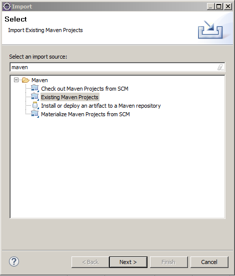
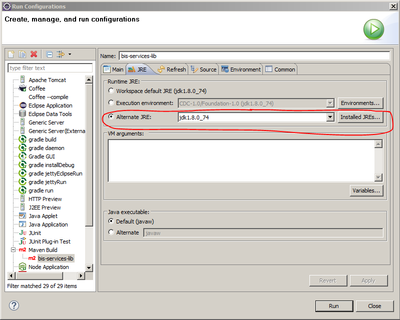

# Experian API Java Library

The Experian Java library provides convenient access to the RESTful Experian APIs from Applications written in Java.
This package is for use with Java Application (Core Java/ J2EE or any similar Java Enabled Platform like Android) that uses Experian client_id, client_secret, username, password and subcode (if applicable).

## Documentation

For Detailed documentation of Experian APIs, visit [Experian Developers Portal](http://developer.experian.com/)

## Java Library Workspace Setup & Development

### Prerequisites

 1. JDK 1.8
 2. Eclipse Mars or newer version
 3. Maven 2+ (or Eclipse Embedded
 4. Git Client (e.g Git Bash)

### Steps to Setup Eclipse Workspace
With Git Bash download a copy of the current repository in your system. Navigate to the folder in your system where you want to download the repository using Git Bash and run the following command:

    git clone -b "master" http://YOUR_LAN_ID@bitbucketglobal.experian.local/scm/bis/bis_api_java.git
   
If you want to download a different branch other than `master`, please change the branch name in above command. Also put your Lan Id in place of *YOUR_LAN_ID*

Configuring Maven and JDK with Eclipse is outside the scope of this document. 

Open Eclipse and select the workspace path as:

    ROOT_PATH_WHERE_REPO_DOWNLOADED/bis_api_java/MavenWorkspace

Now in the Project Explorer window right click and select the following option:

    Import >> Import >> Existing Maven Project (from the Tree View) >> Click Next

On the next window select the following folder as `Root Directory` 

    ROOT_PATH_WHERE_REPO_DOWNLOADED/bis_api_java/MavenWorkspace

Select all the projects' pom.xml available in the shown list and click `Finish`. The below screenshot doesn't contain a full list of pom.xml files which you will be shown on this wizard. *Make sure you select **all** the pom.xml files.*

This would show all the imported projects in `Project Explorer` in your Eclipse window.

### Building Maven Projects
Following is the Project Structure of the Java Library.

So the Parent Project i.e. `bis-services-lib` has be built using Maven. Right click on the project from Project Explorer and choose the following option:

    Run As >> Run Configuration >> From Left Menu Double Click on Maven Build

Fill in the wizard according to the details shown in the screenshots below.

Make sure to select the JDK (instead of running Maven with JRE, which would give error) on the next Tab.

Finally Click Apply and then click Run. This will build the client libraries available in the workspace.

### Testing the Libraries with Java Service Client
Project `bis-services-test-client` contains example Test Clients for each of the Experian BIS Service Library. This project contains Java classes for each of the APIs. These classes are executable (has `main` methods). So, you can run these Java classes by right clicking and then from `Run As` context menu option by selecting `Java Application`.
